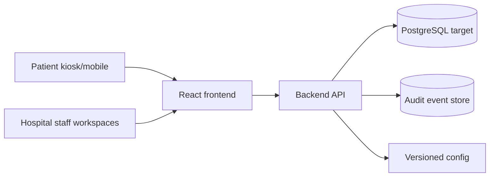

# Architecture

## System Context

## Containers

- `apps/frontend`: React/Vite staff and patient journey UI. It has no database access and reads all dynamic workflow state through the backend API.
- `apps/backend`: API boundary for visit workflow commands, role checks, idempotency, audit events, health checks, and demo persistence.
- `config`: static product, workflow, RBAC, and terminology configuration.
- `infrastructure/migrations`: PostgreSQL target schema.

## Module Boundaries

- Patient arrival: kiosk selection and guided intake.
- Reception: staff review, check-in, token, queue, wayfinding.
- Consultation: doctor notes and human-confirmed CBC/prescription actions.
- Diagnostics: CBC request lifecycle and report visibility.
- Pharmacy and billing: pharmacist review, fulfilment readiness, payment recording.
- Follow-up: reminders and appointment scheduling.
- Operations: read-only journey and audit visibility.

The current local backend uses JSON-file storage only for development persistence. Production implementation should replace that adapter with Prisma/PostgreSQL while preserving API contracts.
